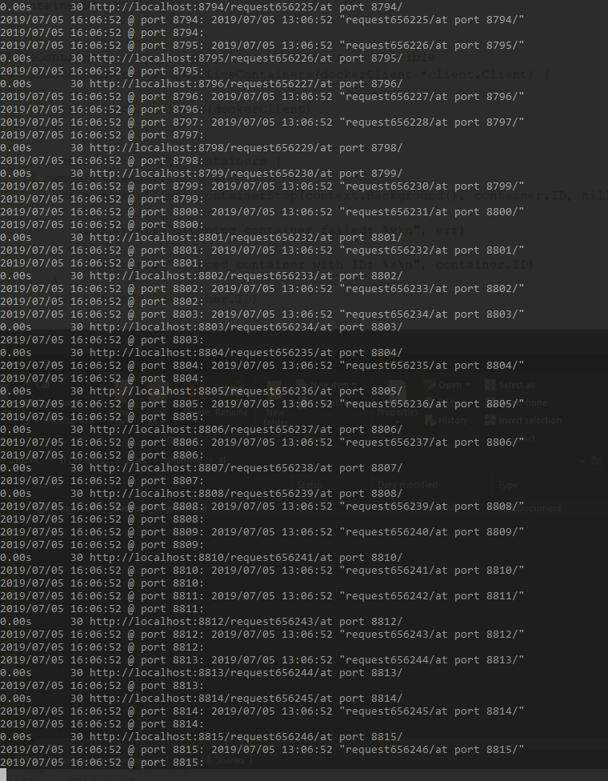

# Docker exercise response #
### by Mario Karagiorgas ### 
salem@gmail.com

6936640563

Tool for meeting these requirements:

* Create a **lean** Docker Image from the *Dockefile* in this repo.

* To launch this simple http://github.com/nethatix/echopathws http listener that echoes back the requested url path i.e., localhost:8770/1/2/3/ -> /1/2/3/.

* Supporting a scalable number of live containers creation. 

* Supporting live-ness both as an app and through few unit tests.

* Consuming the Docker statistics streams for each live container. Optional persistence to an aggregated text file separate from the logs.

* Displaying and aggregating all the logging input streams of the live containers similarly to the statistics streams.

### Deliverable ###

This is a basic statically configured command line application that is efficient, scalable and with no signs of instability rather than brief refactoring lapses :)

Plugging the unit tests channels to monitor the application state changes were trickier than the streaming plugging.

### Testing ### 

For this server application testing I focused on scalability, stability, efficiency and streaming logging correctness rather than micro validating lesser characteristics. 

An interesting unit test is one that launches 100 instances (could be a thousand as far as I could tell on my old windows machine) while simultaneously I let loose the I/O blast of 200 reader streams, a rapid fire httpGet requester and 4 ouputs (stdout, stderr, log, statsfile). I left it there waiting to crash... but it didn't :)

- - - -

##### Windows getting along with 100 docker containers just fine! #####

### Installation ###

The application builds and runs both *on* and *off* the **gopath** within the root folder:
These commands worked in both locations on/off gopath locations:

`go build ./...` 

`go vet`

`go` `build` `-race` producing `tlex` or `tlex.exe` executables....

`go run tlex`

`code()`

Few unit tests require application modifications to plug to the channel events. Go's new module dependency manager choked on this project.

If you need any help to evaluate this or questions, please do not hesitate to contact me. I can package this with any older dependency managers of your preference.

### Interesting Paths & Files ###

    Dockerfile // (in root folder. )

    tlex/logFile.log        // is the application log file.

    tlex/StatsLogFile.log   // is the application stats file.

    tlex/workflow/           // the unit tests root folder.

    workflow/testdata/Dockerfile // the unit tests Dockerfile

    workflow/testdata/logFile.log // the unit tests log file. 

    workflow/testdata/StatsLogFile.log // the stats unit tests file.

#### The Simple Echo Path HTTP Server Contenarized for this Exercise ####

    `https://github.com/nethatix/echopathws` // public repo.
